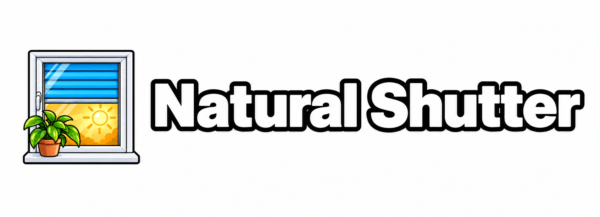

[English documentation](README.md)

# Natural Shutter

<p align="center">
  
</p>

Natural Shutter ergänzt deine vorhandenen Home-Assistant-Rollläden um eine
gespeicherte Ziel-Position und einen Fahrpuffer. Unterstützt werden Covers mit
Positionsbefehlen, beispielsweise aus Homematic IP, Shelly und anderen Integrationen.

## Funktionen

- Jeden Rollladen manuell über die HA-Oberfläche hinzufügen; keine automatische Aufnahme.
- Zwei unabhängige Schieberegler pro Rollladen: **Ziel-Position** und **Puffer**.
- Zwei numerische Verlaufssensoren: **Ziel-Position Verlauf** und **Puffer Verlauf**.
- Bei Start, Reload und nach gemeldeten Fahrten übernimmt das Ziel die Istposition
  ohne Fahrbefehl; der Puffer bleibt erhalten.
- Deutsche und englische Einrichtung, Entitätsnamen und Aktionsfehlermeldungen.
- Vorhandene Cover-Entitäten und Herstellerintegrationen werden weiter verwendet.
- Der Zielregler benötigt eine bekannte aktuelle Quellposition; Wiederverbindung ohne Fahrt.
- Alle hinzugefügten Rollläden stehen unter **Natural Shutter** im Reiter **Integrationen**.
- Gegenseitige Navigation über **Verknüpfte Geräte** zwischen virtuellem Gerät und Aktor.
- Aktivitätseinträge für gesendete Fahrbefehle, durch die Positions-/Pufferregel
  unterdrückte Zieländerungen und Zielabgleiche nach externen Positionsänderungen;
  optional Handy-Meldungen für unterdrückte Fahrten.

## Ziel-Position und Puffer

**Ziel-Position:** 0 % bedeutet vollständig geöffnet, 100 % vollständig geschlossen.
Der Wert hält deine Einstellung fest, bis die Quelle nach einer Fahrt eine geänderte
Position meldet. Das gilt für Fahrten über Wandtaster, Hersteller-App, Alexa, das
ursprüngliche HA-Cover, andere Automationen und Natural Shutter selbst. Nach
Fahrtende übernimmt das Ziel die entsprechende Endposition. Während einer gemeldeten
Fahrt bleibt deine Einstellung stehen. Ein durch den Puffer unterdrücktes Ziel
bleibt gespeichert, solange sich die Istposition nicht ändert.

**Puffer:** der Mindestabstand in **Prozentpunkten** zwischen Istposition und
gewünschter Position. Eine Fahrt wird nur ausgelöst, wenn du das Ziel ausdrücklich
änderst, der Rollladen davon abweicht und der Abstand mindestens dem Puffer
entspricht. Bei Puffer 0 sendet jede Zieländerung mit abweichender Istposition einen
Befehl. Die Änderung des Puffers selbst löst niemals eine Fahrt aus.

Beide Regler reichen von 0 bis 100 %, Schrittweite 1. Dezimale Aktionswerte werden
auf ganze Prozent gerundet, bei einer Hälfte aufwärts. Ungültige Werte und Werte
außerhalb des Bereichs werden abgelehnt.

### Beispiel

Ändere das Ziel auf **70 %** bei **10 %** Puffer. Natural Shutter fordert am
ursprünglichen HA-Cover **30 %** an. Dessen Skala lautet 0 % geschlossen und
100 % geöffnet.

| Aktuelle HA-Position | Abstand | Ergebnis |
| --- | --- | --- |
| 45 % | 15 Punkte | Auf 30 % fahren |
| 40 % | 10 Punkte | Auf 30 % fahren |
| 35 % | 5 Punkte | Ziel speichern; stehen bleiben |
| 30 % | 0 Punkte | Stehen bleiben |
| 20 % | 10 Punkte | Auf 30 % fahren |
| 15 % | 15 Punkte | Auf 30 % fahren |

Dieselbe Regel gilt für vollständig geöffnete und geschlossene Ziele.

## Installation

Voraussetzung: **Home Assistant ab 2026.8.0** und ein Cover, das absolute
Positionsbefehle unterstützt. Die Geräteverknüpfung verwendet die seit HA 2026.8
getrennten Geräte verschiedener Integrationen. Ältere Versionen werden vor Änderungen
an Einstellungen oder Geräten abgelehnt. Die automatisierten Tests verwenden HA
2026.9.4; die Registry-APIs der Mindestversion wurden geprüft, ihr vollständiger
Laufzeitbetrieb jedoch noch nicht. Das mitgelieferte Integrationsicon wird automatisch
angezeigt.

### HACS als benutzerdefiniertes Repository

Natural Shutter ist über HACS als benutzerdefiniertes Repository aus
[jan-brinkmann/ha-natural-shutter](https://github.com/jan-brinkmann/ha-natural-shutter)
installierbar. HACS muss in Home Assistant bereits installiert und eingerichtet sein.

1. Öffne **HACS → ⋮ → Benutzerdefinierte Repositories**.
2. Trage `https://github.com/jan-brinkmann/ha-natural-shutter` ein und wähle **Integration**.
3. Klicke auf **Hinzufügen** und schließe den Dialog für benutzerdefinierte Repositories.
4. Suche in HACS nach **Natural Shutter**, öffne den Eintrag und klicke auf **Herunterladen**.
5. Starte Home Assistant vollständig neu.
6. Folge der Einrichtung unten, um deine Rollläden hinzuzufügen.

Die [offizielle HACS-Anleitung](https://www.hacs.xyz/docs/faq/custom_repositories/)
beschreibt das Hinzufügen benutzerdefinierter Repositories.
[GitHub-Releases sind optional](https://www.hacs.xyz/docs/publish/integration/):
Ohne Releases lädt HACS den Standardbranch des Repositorys herunter.

### Manuelle Installation

1. Lade das [Repository als ZIP](https://github.com/jan-brinkmann/ha-natural-shutter/archive/HEAD.zip)
   herunter und entpacke es.
2. Kopiere den vollständigen Ordner `custom_components/natural_shutter` nach
   `<Konfigurationsverzeichnis>/custom_components/natural_shutter`.
   Unter Home Assistant OS beginnt der Pfad üblicherweise mit `/config`.
3. Prüfe, dass `manifest.json` direkt in diesem Ordner liegt.
4. Starte Home Assistant vollständig neu und folge der Einrichtung unten.

### Aktualisierungen

Lade verfügbare Updates über HACS herunter und starte Home Assistant vollständig
neu. Bei manueller Installation ersetzt du den Integrationsordner durch die
aktualisierte Kopie und startest neu. Bestehende Einträge können erhalten bleiben:
Beim Laden übernimmt das Ziel im Stillstand die aktuelle Quellposition ohne Fahrt
und der gespeicherte Puffer bleibt erhalten. Meldet die Quelle eine Fahrt, wartet
der Abgleich auf deren Ende.

## Einrichtung und tägliche Verwendung

1. Öffne **Einstellungen → Geräte & Dienste → Integration hinzufügen → Natural Shutter**.
2. Wähle ein vorhandenes Cover. Vergib optional einen gut unterscheidbaren Namen.
3. Wiederhole die Einrichtung für jeden weiteren Rollladen. Jeder Eintrag erhält
   ein eigenes virtuelles Gerät mit vier Entitäten; doppelte Quellen werden abgelehnt.

Alle Einträge findest du gemeinsam unter **Einstellungen → Geräte & Dienste →
Integrationen → Natural Shutter**. Auf der Seite eines virtuellen Geräts führt
**Verknüpfte Geräte** zum Aktor aus Shelly, Homematic IP oder einer anderen
Quellintegration. Auf der Aktorseite erscheint umgekehrt das Natural-Shutter-Gerät.
Dafür werden ausschließlich Kennungen und Verbindungen am virtuellen Gerät ergänzt.
Metadaten, Integrationszugehörigkeit und Entitäten des Aktors bleiben unverändert.
Die Verknüpfung folgt einer geänderten Gerätezuordnung und einer Neukonfiguration
ohne Fahrt. Nach dem Integrationsupdate und einem vollständigen HA-Neustart erhalten
auch bestehende Einträge die Verknüpfung; erneutes Hinzufügen ist nicht erforderlich.

Hat das Quell-Cover kein registriertes Gerät, gibt es kein Aktorgerät zum Verknüpfen.
Bei einem Cover als untergeordnetem Kanalgerät führt der Link zum übergeordneten
Aktor: Die HA-Liste **Verknüpfte Geräte** unterstützt Hauptgeräte.

Der Puffer beginnt bei **0 %**. Bei jedem Laden der Integration, auch bei Start und
Reload, wird die Ziel-Position im Stillstand auf **100 minus die aktuelle
HA-Position des Quell-Covers** gesetzt und auf ganze Prozent gerundet. Meldet die
Quelle Öffnen oder Schließen, bleibt das gespeicherte Ziel bis zum Fahrtende stehen.
Der Abgleich sendet keinen Fahrbefehl, unabhängig vom Puffer. Der gespeicherte Puffer
bleibt erhalten.

Fehlt beim Laden eine gültige aktuelle Position, bleibt das gespeicherte Ziel
erhalten. Bei einer neuen Zuordnung dient die bei der Auswahl erfasste Position
als interner Ersatzwert, andernfalls 0 %. Der Zielregler bleibt bis zur Rückkehr
einer gültigen aktuellen Position nicht verfügbar; der Verlaufssensor zeigt den
gespeicherten Wert. Eine erstmals bekannte oder geänderte Position wird nach der
unten beschriebenen Wartezeit abgeglichen.

Bediene die Regler auf der Geräteseite oder in einer Standard-Dashboard-Karte.
Automationen können `number.set_value` für den Zielregler aufrufen. Die genauen
Entity-IDs findest du auf der Geräteseite; sie hängen von Sprache und Namen ab.

```yaml
service: number.set_value
target:
  entity_id: number.wohnzimmer_ziel_position  # Durch deine Entity-ID ersetzen.
data:
  value: 70
```

Über **Neu konfigurieren** im Menü des Eintrags kannst du den Namen ändern oder
eine fehlende Quelle ausdrücklich ersetzen. Dabei wird der Eintrag neu geladen:
Der Puffer bleibt erhalten, das Ziel übernimmt eine gültige aktuelle Quellposition
im Stillstand ohne Fahrt. Ziel und Puffer stellst du weiterhin direkt über die Regler ein.

### Istposition nachführen

Meldet das Cover **Öffnen** oder **Schließen**, wartet Natural Shutter auf das
Fahrtende und anschließend **zwei Sekunden** auf verspätete Endpositionsmeldungen.
Eine geänderte Endposition startet diese Wartezeit erneut. Danach wird das
entsprechende Ziel gespeichert und im Verlaufssensor sichtbar. Dabei entstehen
weder ein weiterer Fahrbefehl noch eine Handy-Benachrichtigung. Ändert eine externe
Positionsänderung das gespeicherte Ziel, erscheint ein Aktivitätseintrag
**Zielwert aktualisiert** mit altem und neuem Ziel, Istposition auf beiden Skalen,
Quelle und lokaler Uhrzeit. Rückmeldungen eigener Fahrten erzeugen keinen
zusätzlichen Eintrag. Der Puffer bleibt unverändert.

Bei Quellen ohne Fahrstatus erfolgt der Abgleich nach **zehn Sekunden** ohne
Positionsänderung. Unter **Konfigurieren** lässt sich pro Rollladen die
**Ruhezeit ohne Fahrstatus** zwischen 1 und 300 Sekunden einstellen. Wähle sie
länger als die Abstände zwischen den Positionsmeldungen deines Aktors. Ohne
Fahrstatus lässt sich eine Meldepause nicht sicher von einem Stillstand unterscheiden.

Eine ausdrücklich eingegebene Zieländerung verwirft ältere vorgemerkte Abgleiche.
Spätere tatsächliche Positionsänderungen können das Ziel nach Fahrtende wieder
aktualisieren. Unbekannte oder nicht verfügbare Positionen brechen wartende
Abgleiche ab und machen den Zielregler nicht verfügbar. Jede Instanz verfolgt ihre
eigene Fahrt und Wartezeit.

Die Zuordnung nutzt den HA-Kontext der Quelle und einen gemerkten eigenen
Fahrbefehl. Ohne Ursprungsinformation werden Rückmeldungen innerhalb dessen
Fahrbereich und Richtung dem laufenden eigenen Befehl zugeordnet. Die Zuordnung
endet nach fünf Minuten, nach dem Abgleich oder nach gemeldetem Stopp, wenn in der
anschließenden Wartezeit keine Positionsänderung eintrifft. Ein anderer
Benutzer-/Automationskontext, eine Gegenfahrt oder
eine Position außerhalb des Fahrbereichs kennzeichnet eine externe Änderung.
Die Zuordnung bleibt bei einem Reload während der Fahrt erhalten, aber nicht bei
einem HA-Neustart. Ein manueller Eingriff während einer eigenen Fahrt lässt sich
ohne Ursprungsinformation nicht sicher erkennen, wenn er demselben Fahrweg folgt.

### Fahrentscheidungen nachvollziehen

Wenn du den normalisierten Zielwert änderst und die bekannte Positions-/Pufferregel
keinen Fahrbefehl zulässt, erscheint ein Eintrag in **Aktivität** am Zielregler und
am virtuellen Natural-Shutter-Gerät. Die Meldung unterscheidet **Abstand kleiner
als Puffer** und **Zielposition bereits erreicht**. Der neue Zielwert bleibt gespeichert.

Wenn die Integration einen Fahrbefehl auslöst, erscheint zusätzlich der Eintrag
**Fahrbefehl gesendet**. Er entsteht nach dem erfolgreichen Aufruf von
`cover.set_cover_position` und enthält dieselben Werte, mit der Istposition vor
dem Befehl. Dafür wird keine Handy-Benachrichtigung gesendet. Der Eintrag bestätigt
den erfolgreichen Aktionsaufruf. Spätere Quellmeldungen aktualisieren das
gespeicherte Ziel; dieser Eintrag bestätigt keine physische Ankunft.

Für die Meldung einer unterdrückten Fahrt auf dem Handy öffne **Einstellungen → Geräte & Dienste →
Natural Shutter → Konfigurieren** beim gewünschten Rollladeneintrag. Wähle unter
**Benachrichtigungsdienst des Handys** dessen `notify.mobile_app_…`-Dienst.
Das Handy muss mit der Home Assistant Companion App an deiner HA-Instanz angemeldet
sein und Benachrichtigungen erlauben; die App stellt dafür einen
[Benachrichtigungsdienst](https://companion.home-assistant.io/docs/notifications/notifications-basic/)
bereit. Ohne registriertes Handy bietet die Auswahl nur **Push-Nachrichten deaktiviert**.
Push-Nachrichten sind zunächst deaktiviert und lassen sich pro Rollladen aktivieren,
wechseln oder wieder abschalten. Die Änderung gilt sofort, ohne Reload, Positionsabgleich
oder Fahrt. Die Aktivitätseinträge entstehen auch bei deaktivierten Push-Nachrichten.

Fahrentscheidungseinträge und Unterdrückungsmeldungen enthalten Datum und Uhrzeit in der HA-Zeitzone einschließlich
UTC-Offset, Rollladenname und Quell-Entity-ID, den vorherigen und neuen Zielwert,
die Istposition auf beiden Skalen, das HA-Ziel, den Abstand und den Puffer in
Prozentpunkten (`pp`). Die Sprache folgt der in HA konfigurierten Sprache
(Deutsch oder Englisch, mit englischer Rückfallebene).

Beispiel: Zieländerung von 30 auf 70 %, HA-Istposition 35 %, Puffer 10 pp:

```text
Wohnzimmer: Keine Fahrt
2026-10-05 14:34:56+02:00 · cover.wohnzimmer: Abstand kleiner als Puffer.
Ziel 30 → 70 %, Ist 65 % (HA 35 %), HA-Ziel 30 %, Abstand 5 pp, Puffer 10 pp.
```

Bei einem Abstand genau gleich dem Puffer wird wie bisher gefahren und ein
**Fahrbefehl gesendet**-Eintrag erzeugt. Derselbe normalisierte Zielwert,
Pufferänderungen, externe Bewegungen, Start und Reload erzeugen keine
Fahrentscheidungseinträge oder Handy-Meldungen.
Nicht verfügbare Quellen und ungültige Positionen machen den Zielregler nicht
verfügbar. Werden Quelldaten während einer angenommenen Zieländerung ungültig oder
schlägt ein Fahrbefehl fehl, gelten die bisherigen Aktions- und Protokollmeldungen.
Spätere Quellmeldungen gleichen nur das gespeicherte Ziel ab. Externe Zieländerungen
erzeugen den oben beschriebenen separaten Eintrag **Zielwert aktualisiert**.
Bleibt das gerundete Ziel gleich, entsteht kein solcher Eintrag.

Die Aktivitätsanzeige benötigt HA **Aktivität/Logbook** und **Recorder**; deren
Filter und Aufbewahrungsdauer gelten auch für diese Einträge. Ein Standard-Dashboard
kann sie mit der unten verlinkten Aktivitätskarte anzeigen. Wenn der gewählte
Handy-Dienst fehlt oder eine Push-Nachricht fehlschlägt, bleibt der Aktivitätseintrag
erhalten und HA protokolliert den Benachrichtigungsfehler. Das Ziel und die Fahrentscheidung
bleiben dabei erhalten; es gibt keinen automatischen Wiederholungsversuch.

Siehe [Standard-Dashboard-Beispiele](examples/dashboard.yaml),
[lokale Testanleitung](docs/TESTING.md) und [Architektur auf Englisch](ARCHITECTURE.md).

## Verhalten und Grenzen

- Installation, Start, Reload, Wiederherstellung, Wiederverbindung, externe
  Bewegungen, Sensoraktualisierungen, Pufferänderungen und das erneute Setzen
  desselben normalisierten Zielwerts lösen keine Fahrt aus. Es gibt keine
  automatische Nachregelung auf das gespeicherte Ziel.
- Der Zielregler ist nicht verfügbar, wenn die Quelle fehlt, unbekannt, nicht
  verfügbar, deaktiviert, wiederhergestellt oder ohne gültige Position von 0 bis 100 ist.
  Ziel-Aktionen werden dann von HA übersprungen, ohne einen neuen Wert zu speichern.
  Bei Rückkehr gültiger Daten erscheint das gespeicherte Ziel wieder. Geänderte
  oder erstmals bekannte Positionen werden nach der Wartezeit ohne Fahrt
  abgeglichen. Puffer und Verlaufssensoren bleiben verfügbar.
- Fällt die Quelle während des Speicherns einer bereits angenommenen Zieländerung
  aus oder liefert sie eine ungültige Istposition, bleibt das neue Ziel gespeichert.
  Die übersprungene Aktion wird in Oberfläche/Aktionsverlauf und HA-Protokoll
  gemeldet. Nichts wird vorgemerkt. Auch fehlgeschlagene Cover-Aktionen behalten das
  Ziel und werden nicht automatisch wiederholt. Für einen neuen Versuch musst du
  bei verfügbarer Quelle ausdrücklich einen anderen Zielwert wählen.
- Quellen mit stabiler Registry-Identität können umbenannt werden. Ohne diese
  Identität ist nach einer Entity-ID-Umbenennung eine manuelle Neukonfiguration
  erforderlich.
- Die Verlaufssensoren zeigen Einstellungen und passive Positionsabgleiche, auch
  bei unterdrückten Fahrten.
  Verfügbarkeit und Aufbewahrungsdauer des Verlaufs hängen von **Recorder** und
  dessen Filtern ab. Ein eigenes Archiv oder Langzeitstatistiken werden nicht erstellt.
- Kalibrierung, Fahrtrichtung, Fahrfortschritt und Gerätekommunikation liegen bei
  der Quellintegration. Tests mit echter Hardware wurden nicht ausgeführt.

## Entfernen

Entferne den gewünschten Eintrag unter **Einstellungen → Geräte & Dienste →
Natural Shutter**. Nur seine vier Entitäten und gespeicherten Einstellungen werden
entfernt. Das Quell-Cover und andere Zuordnungen bleiben erhalten. Recorder-Verlauf
unterliegt weiterhin dessen Aufbewahrung. Nachdem alle Einträge entfernt wurden,
kannst du die Integration über HACS deinstallieren oder ihren Ordner manuell löschen
und Home Assistant neu starten.

## Lizenz

Dieses Projekt steht unter der [MIT-Lizenz](LICENSE).
Copyright (c) 2026 Jan Brinkmann and contributors.
